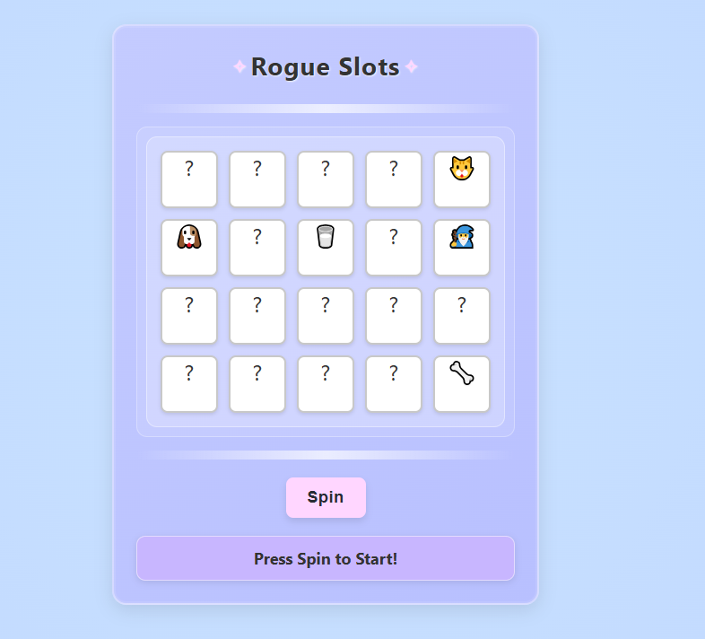

# JavaScript Slots

A fun slot machine game where symbols interact with each other. Inspired by "Luck Be a Landlord".


## What's This?

This is a simple slot machine game with a twist - the symbols actually interact with each other! Cats drink milk, pirates find treasure, and eggs eventually hatch into chickens. Try to make enough money to pay your rent before you get evicted!

This is just meant to be a simple and fun project- you can purchase the real game that inspired me here 

https://store.steampowered.com/app/1404850/Luck_be_a_Landlord/

IT's usually pretty cheap, and it's very fun. 

## Cool Stuff

- Cats drink milk for bonus points
- Skulls get more valuable as you collect more of them
- Choose new symbols after each round
- Some symbols change over time (eggs hatch, plants grow)
- Try to pay your ever-increasing rent!

## How to Play

1. Hit the Spin button
2. Watch your symbols interact
3. Collect coins
4. Every few spins, you need to pay rent
5. Pick a new symbol after each round

## Running It

```
docker build -t slots .
docker run -p 80:80 slots
```

##  Made with

- Vanilla JavaScript
- CSS animations
- Docker for deployment
- GitHub Actions for automatic deployment

## Future Ideas

- More symbols
- Sound effects
- Mobile support
- High score board

Feel free to fork and add your own cool features!